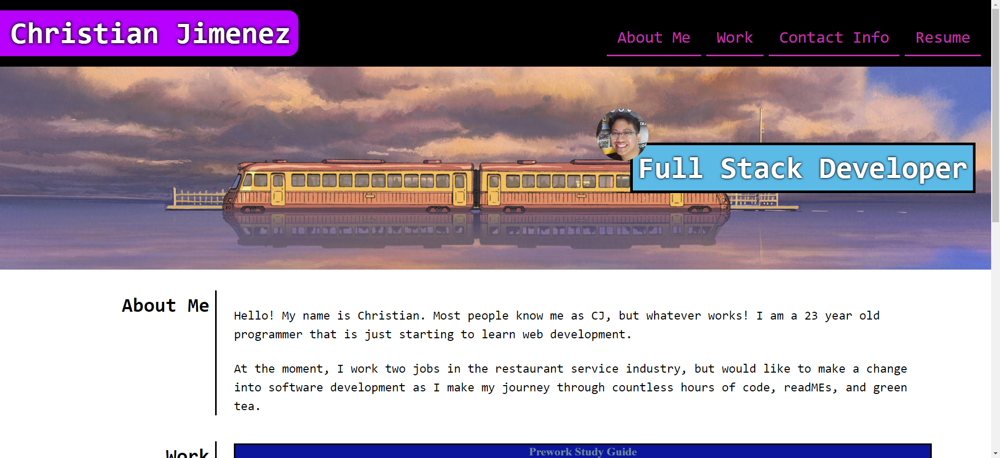

# Personal Portfolio - Module 2 Challenge

## Description

- The project for this was to build a website that showcases my own personal portfolio. I was inspired to put a lot of effort into this project as I've always desired for a website of my own that serves as an introduction to me. I might even work on it more in the future.

## Installation

- Not Applicable.

## Usage

- When opening this website, the user should first land eyes upon a navigation bar. This navigation bar directs them to different parts/sections of the page when clicked upon. There is an About Me section that introduces myself. There is a Work section that showcases any projects I have done and has spots for any projects in the future. There is also a Contact Info section that gives the user links to my phone number, email, GitHub page, and LinkedIn page. There is as well a resume button in my navigation bar that should later link to my resume, but at the moment, my LinkedIn serves as a placeholder.

- [LINK TO WEBSITE](https://seejayee.github.io/portfolio1-/)

## Credits

- Not Applicable.

## License

- MIT License.